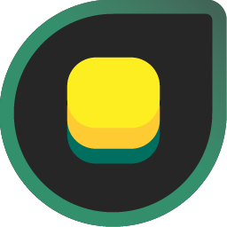

# Atko.Godot.Tiled



[Nuget](https://www.nuget.org/packages/Atko.Godot.Tiled/)

## Project

This project is designed to give Godot Mono users a library to import and manage their Tiled maps.
The core idea is that the only work a user should do is decide how to interpret objects found in the Tiled map.
The rest of the work is done by the library!
AGT is still missing a lot of features, and is very much in development. For example, only orthographic maps are supported currently.

## Getting Started

To use AGT, simply install the library and create an Atlas from the source tmx file.

Additionally, you may give it a callback to handle TmxObjects found in the Tiled map.

### Prerequisites

AGT must be used in Godot Mono solutions using netframework 4.7 or greater.

### Examples

#### Simple Atlas loading

```
AddChild(new Atlas("res://example.tmx");
```

#### Simple Atlas loading with object interpretation

```
AddChild(new Atlas("res://example.tmx", tmxObject => doSomething(tmxObject)));
```

#### Interpreting objects and loading them back into the map

```
var objectSlice = new AtlasSlice();

var atlas = new Atlas("res://example.tmx", tmxObject => {
	var myEntity = InterpretObject(tmxObject);
	objectSlice.AddChild(myEntity);
});

atlas.InsertSlice(objectSlice);

AddChild(atlas);
```

### Features

#### Simple Loading

Atko.Godot.Tiled automatically loads all tile layers into the Atlas as AtlasSlices.

#### Custom Object Loading

Atko.Godot.Tiled gives the user all TmxObjects to handle as they choose.

Atko.Godot.Tiled does not add TmxObjects to the scene. TmxObjects are meant to be interpreted by the user for their individual use case.
